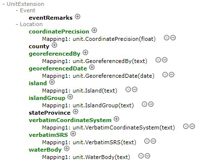

# avh-biocase
CMF template for AVH data delivered as ABCD with Darwin Core and HISPID 5 extensions.

This template updates the off-the-shelf ABCD CMF template to ABCD 2.06b and adds Darwin Core elements used in HISPID that have no ABCD mapping to the Unit and Identification Result extensions. As ABCD 2.06b already incorporated a few new Darwin Core elements and most other Darwin Core elements have ABCD mappings, only a few elements needed to be added to the extensions. I have included the **Event** class and **eventRemarks** element just to indicate that we do not equate Gathering with Event or Gathering Notes with eventRemarks, like the standard ABCD to Darwin Core mapping does, but this doesn't preclude us from using it, for collecting trips for example, even though HISPID isn't using it yet.

The new elements in the HISPID namespace can't be added, as long as the HISPID 5 extension is still in use (which it is with about a third of the AVH providers).

The template file can be found at [templates/cmf/cmf_ABCD_AVH.xml](https://github.com/hiscom/avh-biocase/blob/master/templates/cmf/cmf_ABCD_AVH.xml). It needs to be added on the same path in your BioCASe provider software directory. Also make sure that the 'dwc' and 'abcd' aliases in the [config/namespaces.ini file](https://github.com/hiscom/avh-biocase/blob/master/config/namespaces.ini) have the correct namespace.

I have also updated the upgrade scripts in [templates/upgrade](https://github.com/hiscom/avh-biocase/tree/master/templates/cmf/upgrades), so you can easily upgrade from the HISPID 5 mapping to the new AVH ABCD mapping (bad luck if you are already using ABCD). Just copy the files into the templates/update directory. This will not transfer the MeasurementOrFacts mappings and also not the mappings to the elements in the HISPID 5 extension, which you will still have to do manually.
